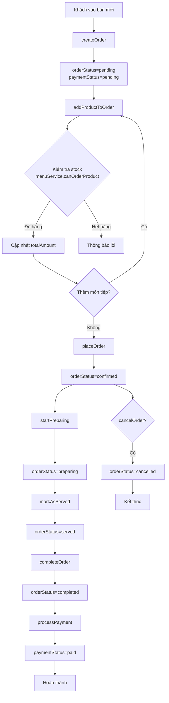

# OrderService - Hướng dẫn sử dụng

## Tổng quan

`OrderService` là service chính để xử lý toàn bộ lifecycle của một đơn hàng trong hệ thống quản lý cafe. Service này tuân theo flow xử lý đơn hàng chuẩn từ khi khách vào bàn đến khi thanh toán.

## Flow xử lý đơn hàng



## Các trạng thái Order

### Order Status
- **pending**: Đơn hàng mới tạo, đang thêm món
- **confirmed**: Đã xác nhận đơn hàng
- **preparing**: Đang chuẩn bị món
- **served**: Đã phục vụ xong
- **completed**: Hoàn thành đơn hàng
- **cancelled**: Đã hủy đơn hàng

### Payment Status
- **pending**: Chưa thanh toán
- **paid**: Đã thanh toán

## Các phương thức chính

### 1. Tạo đơn hàng mới

```java
OrderService orderService = new OrderService();

// Tạo đơn hàng mới khi khách vào bàn
Order order = orderService.createOrder(
    tableId,    // ID của bàn
    userId,     // ID của nhân viên
    customerId  // ID của khách hàng (có thể null)
);

if (order != null) {
    System.out.println("Đã tạo đơn hàng: " + order.getOrderNumber());
}
```

### 2. Thêm sản phẩm vào đơn hàng

```java
// Thêm sản phẩm vào đơn hàng
boolean success = orderService.addProductToOrder(
    order,      // Đơn hàng
    product,    // Sản phẩm
    quantity,   // Số lượng
    notes       // Ghi chú (có thể null)
);

if (success) {
    System.out.println("Đã thêm sản phẩm thành công");
} else {
    System.out.println("Không thể thêm sản phẩm (hết hàng hoặc lỗi)");
}
```

### 3. Xác nhận đơn hàng

```java
// Xác nhận đơn hàng (chuyển từ pending sang confirmed)
boolean confirmed = orderService.placeOrder(order);

if (confirmed) {
    System.out.println("Đã xác nhận đơn hàng");
}
```

### 4. Quản lý trạng thái đơn hàng

```java
// Bắt đầu chuẩn bị
orderService.startPreparing(order);  // confirmed → preparing

// Đánh dấu đã phục vụ
orderService.markAsServed(order);    // preparing → served

// Hoàn thành đơn hàng
orderService.completeOrder(order);   // served → completed
```

### 5. Thanh toán

```java
// Xử lý thanh toán
boolean paymentSuccess = orderService.processPayment(
    order,           // Đơn hàng
    "CASH",          // Phương thức thanh toán
    amountReceived   // Số tiền khách đưa
);

if (paymentSuccess) {
    double change = orderService.calculateChange(order, amountReceived);
    System.out.println("Thanh toán thành công. Tiền thối: " + change);
}
```

### 6. Hủy đơn hàng

```java
// Hủy đơn hàng (chỉ có thể hủy khi pending hoặc preparing)
boolean cancelled = orderService.cancelOrder(order, "Khách không muốn nữa");

if (cancelled) {
    System.out.println("Đã hủy đơn hàng");
}
```

## Các phương thức tiện ích

### Kiểm tra trạng thái

```java
// Kiểm tra có thể chỉnh sửa đơn hàng không
if (orderService.canModifyOrder(order)) {
    // Có thể thêm/xóa/sửa sản phẩm
}

// Kiểm tra có thể thanh toán không
if (orderService.canPayOrder(order)) {
    // Có thể thanh toán
}
```

### Tìm kiếm đơn hàng

```java
// Lấy đơn hàng theo ID
Optional<Order> order = orderService.getOrderById(orderId);

// Lấy đơn hàng đang active theo bàn
Optional<Order> activeOrder = orderService.getActiveOrderByTable(tableId);

// Lấy tất cả đơn hàng theo trạng thái
List<Order> pendingOrders = orderService.getOrdersByStatus("pending");
```

### Tính toán

```java
// Tính tổng tiền từ danh sách sản phẩm
Map<Product, Integer> productQuantities = new HashMap<>();
productQuantities.put(product1, 2);
productQuantities.put(product2, 1);

double total = orderService.calculateTotalAmount(productQuantities);

// Format tiền
String formattedAmount = orderService.formatTotalAmount(total);
// Kết quả: "50,000 VNĐ"
```

## Validation và Error Handling

### Validation tự động

Service tự động kiểm tra:
- **Trạng thái đơn hàng**: Chỉ cho phép thao tác phù hợp với trạng thái hiện tại
- **Stock**: Kiểm tra đủ hàng trước khi thêm vào đơn
- **Số tiền**: Kiểm tra số tiền thanh toán có đủ không
- **Tham số**: Kiểm tra các tham số đầu vào hợp lệ

### Error Handling

```java
try {
    Order order = orderService.createOrder(tableId, userId, customerId);
    if (order == null) {
        // Xử lý lỗi tạo đơn hàng
        showErrorMessage("Không thể tạo đơn hàng");
        return;
    }
    
    boolean added = orderService.addProductToOrder(order, product, quantity, null);
    if (!added) {
        // Xử lý lỗi thêm sản phẩm
        showErrorMessage("Không thể thêm sản phẩm (có thể hết hàng)");
        return;
    }
    
} catch (Exception e) {
    // Xử lý exception
    logger.error("Lỗi xử lý đơn hàng", e);
    showErrorMessage("Có lỗi xảy ra, vui lòng thử lại");
}
```

## Best Practices

### 1. Luôn kiểm tra kết quả trả về

```java
// Tốt
Order order = orderService.createOrder(tableId, userId, customerId);
if (order == null) {
    // Xử lý lỗi
    return;
}

// Không tốt
Order order = orderService.createOrder(tableId, userId, customerId);
// Tiếp tục mà không kiểm tra
```

### 2. Sử dụng Optional cho tìm kiếm

```java
// Tốt
Optional<Order> orderOpt = orderService.getOrderById(orderId);
orderOpt.ifPresent(order -> {
    // Xử lý order
});

// Hoặc
Order order = orderService.getOrderById(orderId).orElse(null);
if (order != null) {
    // Xử lý order
}
```

### 3. Kiểm tra trạng thái trước khi thao tác

```java
// Tốt
if (orderService.canModifyOrder(order)) {
    orderService.addProductToOrder(order, product, quantity, null);
} else {
    showMessage("Không thể chỉnh sửa đơn hàng này");
}
```

### 4. Sử dụng logging

```java
// Thêm logging để debug
System.out.println("Processing order: " + order.getOrderNumber());
boolean success = orderService.placeOrder(order);
System.out.println("Order placement result: " + success);
```

## Integration với các Service khác

### MenuService
- Kiểm tra stock trước khi thêm sản phẩm
- Cập nhật stock sau khi xác nhận đơn hàng

### TableService
- Cập nhật trạng thái bàn khi có đơn hàng active
- Giải phóng bàn khi hoàn thành đơn hàng

### CustomerService
- Liên kết đơn hàng với thông tin khách hàng
- Tính điểm tích lũy sau khi thanh toán

## TODO và Future Enhancements

### Cần implement
- [ ] OrderDetailDAO để lưu chi tiết đơn hàng
- [ ] Các phương thức tìm kiếm trong OrderDAO
- [ ] Integration với MenuService để cập nhật stock
- [ ] Validation chi tiết hơn cho các tham số

### Cải tiến tương lai
- [ ] Hỗ trợ promotion/discount
- [ ] Hỗ trợ nhiều phương thức thanh toán
- [ ] Tính năng đặt hàng trước
- [ ] Báo cáo và thống kê đơn hàng
- [ ] Notification system cho trạng thái đơn hàng

## Ví dụ sử dụng hoàn chỉnh

```java
public class OrderExample {
    public static void main(String[] args) {
        OrderService orderService = new OrderService();
        
        // 1. Tạo đơn hàng mới
        Order order = orderService.createOrder(1, 1, null);
        if (order == null) {
            System.out.println("Không thể tạo đơn hàng");
            return;
        }
        
        // 2. Thêm sản phẩm
        Product coffee = new Product(); // Giả sử đã có product
        coffee.setProductId(1);
        coffee.setName("Cà phê đen");
        coffee.setPrice(25000);
        
        boolean added = orderService.addProductToOrder(order, coffee, 2, "Không đường");
        if (!added) {
            System.out.println("Không thể thêm cà phê");
            return;
        }
        
        // 3. Xác nhận đơn hàng
        boolean confirmed = orderService.placeOrder(order);
        if (confirmed) {
            System.out.println("Đã xác nhận đơn hàng: " + order.getOrderNumber());
        }
        
        // 4. Mô phỏng quá trình chuẩn bị
        orderService.startPreparing(order);
        orderService.markAsServed(order);
        orderService.completeOrder(order);
        
        // 5. Thanh toán
        boolean paid = orderService.processPayment(order, "CASH", 60000);
        if (paid) {
            double change = orderService.calculateChange(order, 60000);
            System.out.println("Thanh toán thành công. Tiền thối: " + 
                             orderService.formatTotalAmount(change));
        }
    }
}
```

## Kết luận

`OrderService` cung cấp một interface hoàn chỉnh và dễ sử dụng để quản lý toàn bộ lifecycle của đơn hàng. Service này tuân theo các nguyên tắc SOLID và cung cấp error handling tốt. Với việc implement đầy đủ các TODO items, service này sẽ trở thành backbone của hệ thống quản lý cafe.
